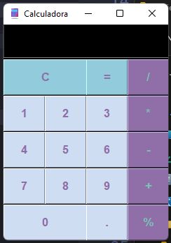
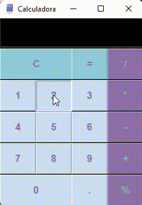

# CALCULADORA BASICA

Programa desenvolvido em Python, calculadora de operações básicas.

## 🚀 Começando

Essas instruções permitirão que você obtenha uma cópia do projeto em operação na sua máquina local para fins de desenvolvimento e teste.

### 📋 Pré-requisitos

1. PYTHON 3.10
2. Tkinter

### 🔧 Instalação
1. Visual Code Studio
2. Nuitka Compilar

## 📦 Imagens do Projeto

## 📌 Animação

 
## 📋 Software Copyleft 

O software copyleft é livre e tem o código-fonte aberto, porém, a principal diferença é que os seus produtores querem evitar que tal sistema seja modificado e vendido. Dessa forma, todas as alterações devem ser registradas como copyleft.

## ❤️ Frase inspiração

* A PROGRAMAÇÃO NÃO É SOBRE O QUE VOCÊ SABE, É SOBRE O QUE VOCÊ PODE DESCOBRIR 🚀

---
⌨️ com ❤️ por [Bianca Karine](https://github.com/Biakgs) 😊
